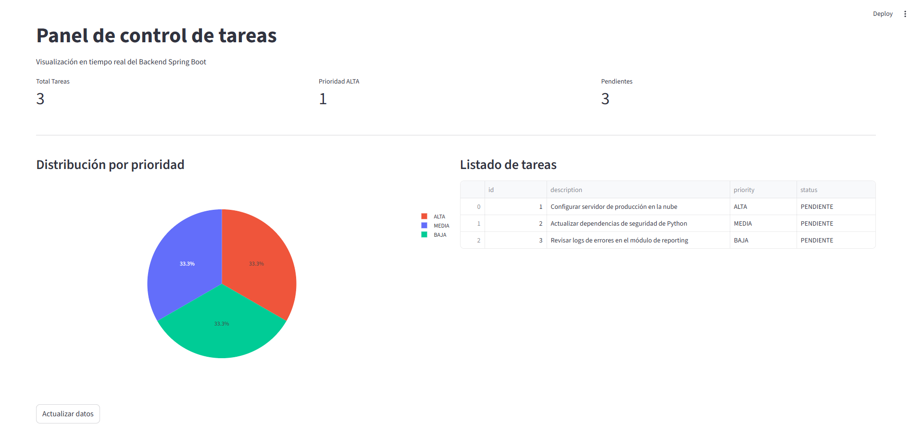

# Sistema de Gestión de Tareas

<p align="center">
  
</p>

Este proyecto es una solución integral y Full-Stack que combina un **Backend robusto en Java**, un **Frontend interactivo en React** y **Clientes de monitoreo en Python**.

## Tecnologías Utilizadas

* **Backend:** Java 25 (LTS), Spring Boot 4, Spring Data JPA.
* **Frontend (SPA):** React (Vite), JavaScript ES6+, CSS3 Moderno con diseño *Dark Mode*.
* **Clientes de Scripting:** Python 3 (Streamlit, Pandas, Plotly, `requests`).
* **Base de Datos:** H2 (En memoria, con inicialización automática mediante `DataInitializer`).
* **Testing y CI/CD:** JUnit 5, MockMvc para tests de integración, y **GitHub Actions** para automatización de pruebas en la nube.

## Estructura del Proyecto
* `/demo`: Código fuente del Backend en Spring Boot.
    * `src/main/java`: Lógica de negocio, controladores REST y modelos.
    * `src/test/java`: Suite de pruebas unitarias y de integración de API (`MockMvc`).
* `/frontend`: Aplicación web moderna SPA construida con React y Vite.
* `dashboard.py` / `reporte.py`: Clientes analíticos en Python para monitoreo de métricas y reportes.

## Calidad del Código (Testing)
El Backend cuenta con una suite completa de pruebas automatizadas que se validan con cada entrega en el repositorio mediante GitHub Actions:
* **Tests Unitarios:** Verificación de restricciones en las entidades.
* **Tests de Integración:** Simulación completa de peticiones HTTP (`GET`, `POST`) utilizando `MockMvc` para validar las respuestas del controlador.

---

## Cómo Ejecutar el Proyecto en Local

### 1. Levantar el Backend (Java)
Abre el proyecto y ejecuta `DemoApplication.java`. El servidor iniciará en `http://localhost:8080`.

### 2. Levantar el Frontend (React)
Abre una terminal nueva en la carpeta del frontend:
```bash
cd frontend
npm install
npm run dev
```
Una vez arrancado, abre en tu navegador: http://localhost:5173